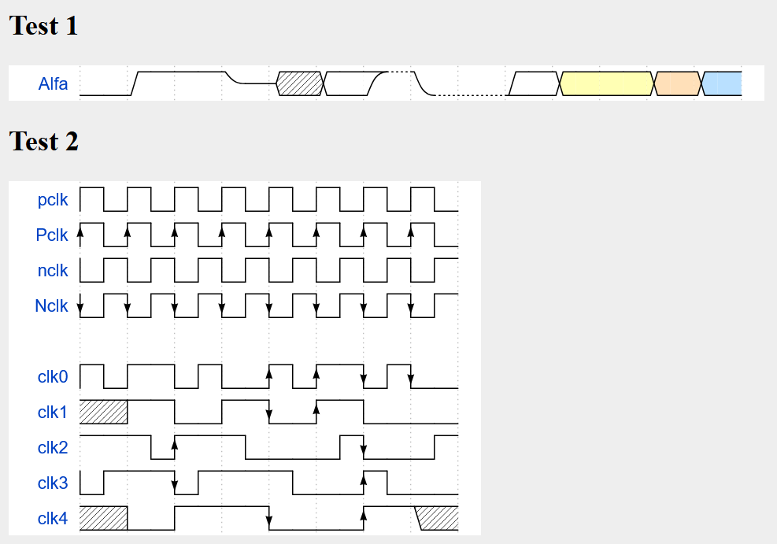
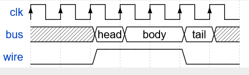
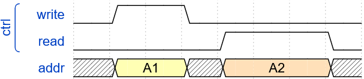
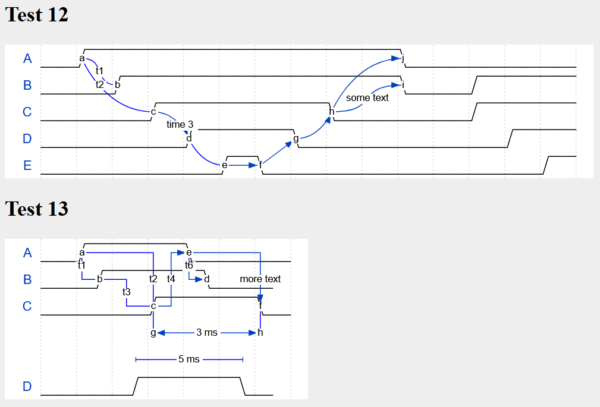
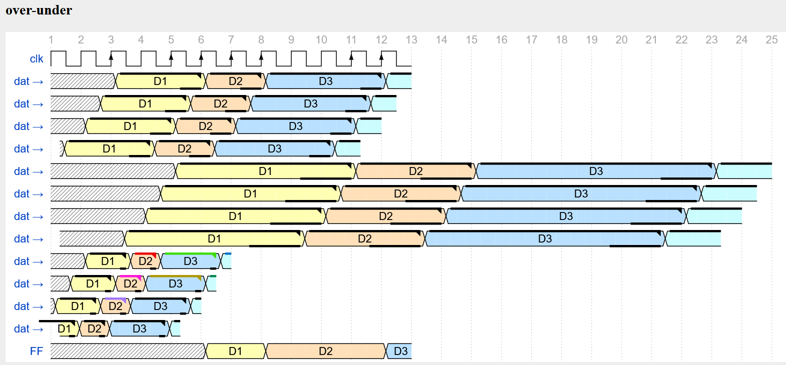

# HOW TO DO:

## ADDING ELEMENTS:

### SIGNALS:

#### WHAT IS THAT?

The parameter signals, contains Lines, which represents the waves. Here are some examples:

#### HOW TO USE?

{ signal: [
  { name: "pclk", wave: 'p.......' },
  { name: "Pclk", wave: 'P.......' },
  { name: "nclk", wave: 'n.......' },
  { name: "Nclk", wave: 'N.......' },
]}

See this example as a refrence, it shows how to use the signal component. Every line has a name, this gets displayed in the beginning (see the picutre above). As a second attribute we have the "wave" attribute, this attribute draws the real wave object.

#### ADDING TEXT:

{ signal: [
  { name: "clk",  wave: "P......" },
  { name: "bus",  wave: "x.==.=x", data: ["head", "body", "tail", "data"] },
  { name: "wire", wave: "0.1..0." }
]}

You can also add text to your text elements using the data atribute, this allows you increase the understanding speed of your graphic.

#### Adding title and Caption:

 head:{
   text:'WaveDrom example',
   tick:0,
 },
 foot:{
   text:'Figure 100',
   tock:9
 },

 You can also add a Text before an after your graphic to describe it.

#### GROUPING:
{signal: [
    ['ctrl',
      {name: 'write', wave: '01.0....'},
      {name: 'read',  wave: '0...1..0'}
    ],
    {  name: 'addr',  wave: 'x3.x4..x', data: 'A1 A2'}
]}

You can create smaler groups for your graphic, by the following: ['name of your groupe', {Element}, {Element}, ...]

#### Phases:
You can manipulate the duration of a phase for a spezific wave/lane, by adding the 'phase:' attribute, this attribute wants an float as an input.

### EDGE:

{ signal: [
  { name: 'A', wave: '01........0....',  node: '.a........j' },
  { name: 'B', wave: '0.1.......0.1..',  node: '..b.......i' },
  { name: 'C', wave: '0..1....0...1..',  node: '...c....h..' },
  { name: 'D', wave: '0...1..0.....1.',  node: '....d..g...' },
  { name: 'E', wave: '0....10.......1',  node: '.....ef....' }
  ],
  edge: [
    'a~b t1', 'c-~a t2', 'c-~>d time 3', 'd~-e',
    'e~>f', 'f->g', 'g-~>h', 'h~>i some text', 'h~->j'
  ]
}

With edges you can create visualise better. When you want to create them, you need to add a node Attribute in every lane you want to use it. Then you can add the edge Attribute, which contains a list of all connections and thier design.

## SKINS, COLORS, AND MORE:

### SKINS:

#### SELECTING A SKIN:

For using a diffrent skin than the default skin, you need to add a new line into your code, after you describe, what you want to be drawn, you can add the config parameter into your code. The config parameter has a attribute called "skin: ", you need to insert into this attribute in '' the skin name of the prefered skin.

#### ADDING A SKIN:

When you want to create a new skin, you need to create a new svg in unpacked/skins, there you can change the names to wathever you want to use as a color. We recomend you to copying one of the existing svgs and to change there your colors, scince this is easier, scince the ids will be set already right.

Now you need to """run npx bin/svg2js.js unpacked/skins/{your skins name here}.svg > skins/{your skins name here}.js"""

Then you just need to do one import in bin/cli.js, ther you need to add the following line after the other skin imports: """ const {your skins name here} = require('../skins/{your skins name here}.js');"""

Add in this line """const skins = Object.assign({}, def, narrow, lowkey);""" your skin after the last skin.

### CHANGING BACKGROUND:

For using a diffrent Background color, just add in your .json5 file in the config parameter the attribute called "background: ", insert into this attribute your preferd color.

### OVER-/UNDERLINES:

{signal: [
  {name: 'clk',   wave: 'p.PpPPPPp.P.'},

  {name: 'dat →', wave: 'x.3..4.5...6', data: 'D1 D2 D3', over: '0.1..1.1...1', under: '0...1010..10'},
  {name: 'dat →', wave: 'x.3..4.5...6', data: 'D1 D2 D3', over: '0.1..1.1...1', under: '0...1010..10', phase: .5},
  {name: 'dat →', wave: 'x.3..4.5...6', data: 'D1 D2 D3', over: '0.1..1.1...1', under: '0...1010..10', phase: 1},
  {name: 'dat →', wave: 'x.3..4.5...6', data: 'D1 D2 D3', over: '0.1..1.1...1', under: '0...1010..10', phase: 1.7},

  {name: 'dat →', wave: 'x.3..4.5...6', data: 'D1 D2 D3', over: '0.1..1.1...1', under: '0...1010..10', period: 2},
  {name: 'dat →', wave: 'x.3..4.5...6', data: 'D1 D2 D3', over: '0.1..1.1...1', under: '0...1010..10', period: 2, phase: .5},
  {name: 'dat →', wave: 'x.3..4.5...6', data: 'D1 D2 D3', over: '0.1..1.1...1', under: '0...1010..10', period: 2, phase: 1},
  {name: 'dat →', wave: 'x.3..4.5...6', data: 'D1 D2 D3', over: '0.1..1.1...1', under: '0...1010..10', period: 2, phase: 1.7},

  {name: 'dat →', wave: 'x.3..4.5...6', data: 'D1 D2 D3', over: '0.1..2.3...4', under: '0...1010..10', period: 0.5},
  {name: 'dat →', wave: 'x.3..4.5...6', data: 'D1 D2 D3', over: '0.1..5.6...7', under: '0...1010..10', period: 0.5, phase: .5},
  {name: 'dat →', wave: 'x.3..4.5...6', data: 'D1 D2 D3', over: '0.1..8.1...1', under: '0...1010..10', period: 0.5, phase: 1},
  {name: 'dat →', wave: 'x.3..4.5...6', data: 'D1 D2 D3', over: '0.1..1.1...1', under: '0...1010..10', period: 0.5, phase: 1.7},

  {name: 'FF',    wave: 'x....3.4...5', data: 'D1 D2 D3'},
], head:{tick: 1}}

when you add the attribute over/under, you can create a spezial under-/overline for the boxes, you can set the color with numbers between 1-8.

### HSCALE:

You can change the size of your graphic by using the hscale attribute in config, 1 is small, 3 is big

## SEE ALSO:

For futher information, please look into:
- [basics](test/test.html); for the basic needs / futher examples
- [Logic-gates](test/test-assign.html); for logical drawings/logic-gates (AND,OR,XOR,!,etc.)